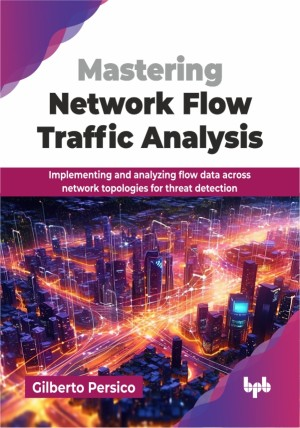

# Mastering Network Flow Traffic Analysis

Implementing and analyzing flow data across network topologies for threat detection.

This is the repository for [Mastering Network Flow Traffic Analysis
](https://bpbonline.com/products/mastering-network-flow-traffic-analysis?variant=44658285248712),published by BPB Publications.

## About the Book
The book aims to familiarize the readers with network traffic analysis technologies, giving a thorough understanding of the differences between active and passive network traffic analysis, and the advantages and disadvantages of each methodology. It has a special focus on network flow traffic analysis which, due to its scalability, privacy, ease of implementation, and effectiveness, is already playing a key role in the field of network security. 

Starting from network infrastructures, going through protocol implementations and their configuration on the most widely deployed devices on the market, the book will show you how to take advantage of network traffic flows by storing them on Elastic solutions to OLAP databases, by creating advanced reports, and by showing how to develop monitoring systems.

CISOs, CIOs, network engineers, SOC analysts, secure DevOps, and other people eager to learn, will get sensitive skills and the knowledge to improve the security of the networks they are in charge of, that go beyond the traditional packet filtering approach.

## What You Will Learn
• Implement flow analysis across diverse network topologies, and identify blind spots.

• Enable flow export from virtualized (VMware, Proxmox) and server environments.

• Ingest and structure raw flow data within Elasticsearch and Clickhouse platforms.

• Analyze flow data using queries for patterns, anomalies, and threat detection.

• Understand and leverage the network flow matrix for security, capacity insights.
